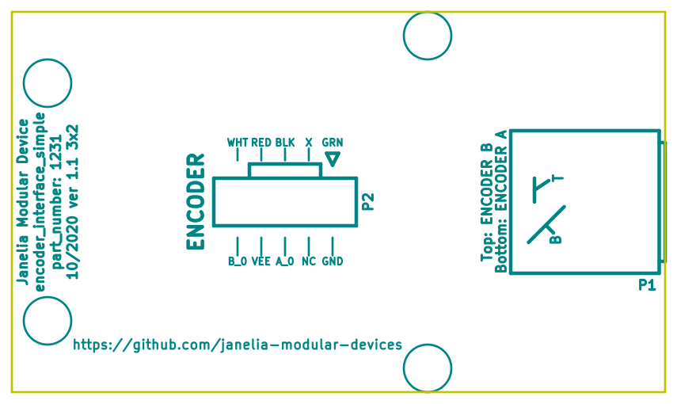

- [Repository Information](#org52fc431)
  - [Description](#orga748eac)
- [Images](#org4c19e3d)
- [Schematic](#orgec002b5)
- [Gerbers](#org0c30e3e)
- [Bill of Materials](#orgb29e6f6)
  - [PCB Parts](#org8cb0470)
  - [Supplemental Parts](#org4135907)
  - [Vendor Parts Lists](#orgea7cc53)
- [Supplemental Documentation](#orgc7262e8)
  - [Assembly Instructions](#orgf035cc8)
- [Manufacturing Archive](#org4deee22)

# Repository Information

-   **Name:** encoder\_interface\_simple\_3x2
-   **Version:** 1.1
-   **License:** Open-Source Hardware
-   **URL:** <https://github.com/janelia-kicad/encoder_interface_simple_3x2>
-   **Author:** Peter Polidoro
-   **Email:** peterpolidoro@gmail.com

## Description

This board provides a simple encoder interace with buffered encoder signal outputs.

# Images

# Schematic

[./schematic/encoder\_interface\_simple\_3x2.pdf](./schematic/encoder_interface_simple_3x2.pdf)

# Gerbers

# Bill of Materials

## PCB Parts

| Item | Reference(s) | Quantity | Manufacturer                    | Manufacturer Part Number | Vendor   | Vendor Part Number | Description                                                       | Package            |
|---- |------------ |-------- |------------------------------- |------------------------ |-------- |------------------ |----------------------------------------------------------------- |------------------ |
| 1    | C1           | 1        | KEMET                           | C1210X104K1RAC7800       | Digi-Key | 399-13229-1-ND     | CAP CER 0.1UF 50V 10% X7R                                         | 1210 (3225 Metric) |
| 2    | MDB1         | 2        | Sullins Connector Solutions     | PBC16SAAN                | Digi-Key | S1011E-16-ND       | 16 Position Header Through Hole Male Pins                         |                    |
| 3    | P1           | 1        | Amphenol RF                     | 112661                   | Digi-Key | ACX1655-ND         | CONN BNC JACK R/A 75 OHM PCB                                      |                    |
| 4    | P2           | 1        | Molex                           | 0740991005               | Digi-Key | WM7205-ND          | CONN HEADER .100 VERT 5POS SMD                                    |                    |
| 5    | R1 R2        | 2        | Panasonic Electronic Components | ERJ-14NF3161U            | Digi-Key | P3.16KAACT-ND      | RES SMD 3.16K OHM 1% 1/2W 1210                                    |                    |
| 6    | U1           | 1        | Texas Instruments               | SN74ABT541BDWR           | Digi-Key | 296-14668-1-ND     | Buffer Non-Inverting 1 Element 8 Bit per Element Push-Pull Output | 20-SOIC            |

## Supplemental Parts

| Item | Quantity | Manufacturer            | Manufacturer Part Number | Vendor   | Vendor Part Number | Description                      |
|---- |-------- |----------------------- |------------------------ |-------- |------------------ |-------------------------------- |
| 1    | 1        | Molex                   | 0050579405               | Digi-Key | WM2903-ND          | CONN HOUSING 5POS .100 W/LATCH   |
| 2    | 5        | Molex                   | 0016021117               | Digi-Key | WM2572-ND          | CONN SOCKET 24-30AWG CRIMP GOLD  |
| 3    | 2        | TPI (Test Products Int) | 58-024-1M                | Digi-Key | 290-1010-ND        | CBL ASSY BNC PLUG-PLUG RG58 24IN |

## Vendor Parts Lists

[./bom/Digi-Key\_parts.csv](./bom/Digi-Key_parts.csv)

[./bom/supplemental\_Digi-Key\_parts.csv](./bom/supplemental_Digi-Key_parts.csv)

# Supplemental Documentation

## Assembly Instructions

-   Solder surface mount and through hole components onto the pcb.

# Manufacturing Archive

Send manufacturing zip file to your favorite PCB manufacturer for fabrication.

[./manufacturing/encoder\_interface\_simple\_3x2\_v1.1.zip](./manufacturing/encoder_interface_simple_3x2_v1.1.zip)
